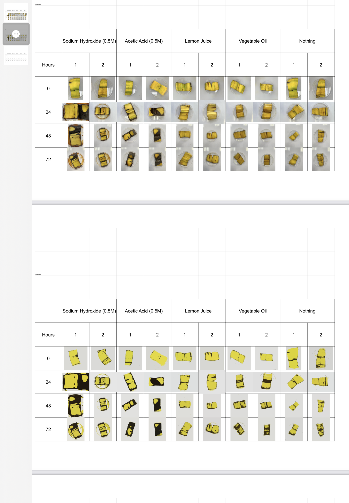
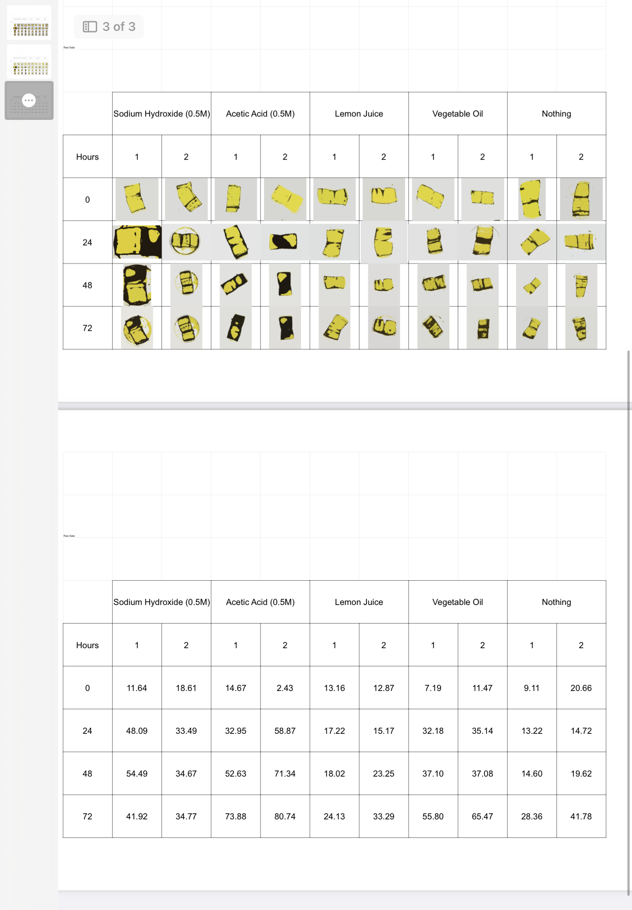

## Percentage Coverage Analysis

A small computer-vision script that measures what percentage of a banana's surface has browned, from a photo. Built for a chemistry project comparing how different preservatives slow down browning over time.

### What it does

Given a folder of banana photos, the script:
1. Segments each image into three regions - **background**, **yellow (fresh)**, and **brown (browned)**
2. Counts pixels in each region
3. Reports `brown / (brown + yellow)` as the coverage percentage

It saves a segmented version of each image (so you can visually verify the classification) and prints the percentage to the console.

### How the algorithm works

The core challenge is that a raw photo has messy, continuous color gradients (dish reflections, shadows, lighting), but we only care about 3 categories. The pipeline gets there in steps:

| Step | Purpose |
|---|---|
| **1. Resize (30%)** | Speeds up the pixel-level operations below |
| **2. Gaussian blur** | Smooths out noise from the petri dish and lighting, without manual photo editing |
| **3. Pull pixels toward reference colors** | Each pixel is nudged halfway toward whichever of white / black / yellow it's closest to (Euclidean distance in RGB). This sharpens the separation between regions *before* clustering, so K-means converges on cleaner groups |
| **4. K-means clustering (k=3)** | Groups pixels into 3 dominant colors: background, yellow, brown |
| **5. Color-frequency filtering** | The cluster closest to white is dropped (background/dish). Of the two remaining, the one closest to reference-yellow is labeled `YELLOW`; the other is `BROWN` |
| **6. Percentage calculation** | `BROWN / (YELLOW + BROWN) * 100` |

### Example

Reading an image, resizing, blurring, clustering, and computing the brown percentage looks like this in the console output:

```
Chemistry Data/day3_modded.png
YELLOW: 8213   BROWN: 3021
Percentage Brown 26.90%
```

A `_modded` copy of each image (showing the 3-color segmentation) is saved next to the original, and a window pops up displaying it - press any key to move to the next image.

### Requirements

```
pip install opencv-python numpy scikit-learn
```

### Usage

1. Put your images inside a folder (the repo's `Chemistry Data/` folder, or your own)
2. Open `coldecimgtopercent.py` and update the hardcoded path near the top to point at that folder:
   ```python
   root_dir = r"path/to/your/Chemistry Data"
   ```
3. Run it:
   ```
   python coldecimgtopercent.py
   ```
4. For each image, a segmented preview window will open - press any key to continue to the next one. Percentages print to the console as they're computed.

> **Note:** this script assumes the *only* colors present are some shade of white/background, yellow, and brown - it's tuned specifically for this banana-browning setup rather than being general-purpose.

### Repo structure

```
ColorSegmentationAlgoPercentageCoverage/
├── coldecimgtopercent.py   # main script
├── Chemistry Data/         # input photos + processed output + final PDF writeup
├── README.md
```

### Data

- **Photos:** taken personally to document the banana's browning over time under different preservative conditions
- **Processed output:** lives in `Chemistry Data/` - includes the algorithm's output alongside a PDF of the final write-up

### Known limitations & possible improvements

- The 3-reference-color approach (white/black/yellow) is hand-tuned for this specific lighting setup and banana coloring - it won't generalize to other fruits or backgrounds without retuning
- The pixel-nudging step (step 3) runs as a nested Python double loop over every pixel, which is slow for larger images - this could be vectorized with NumPy
- **Future direction:** replacing the clustering + reference-color heuristic with a trained neural network for more consistent segmentation across lighting conditions

### Example of Final Processed Data
(Upper Raw Data Files -> Processed Data Files)


(Processed Data Files -> Quantitative Results)
