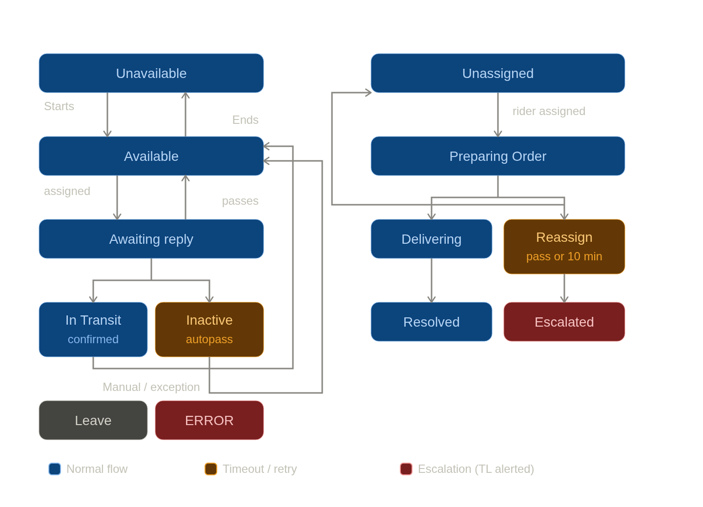

# SeaOil / Segas - Automated Rider Dispatch System

Built during a backend-development shadowing internship at Price Locq, on the SeaGas/SeaOil delivery operations account.

## Overview

SeaGas/SeaOil riders were being dispatched manually out of a Google Sheet: a team lead would read new orders, decide who was free, and message each rider individually over Viber to confirm, then update the sheet by hand as replies came in. This project automates that entire loop so the sheet and Viber conversations stay in sync on their own, with no one babysitting the process.

The system has two parts, reflecting the progression of the internship:

1. **Google Apps Script automation** (`Mostofthescripts/`) - the working prototype, running directly on top of the operations Google Sheet.
2. **NestJS service layer** (`viber.service.ts`, `models/`, `repositories/`, `test.*`) - an early port of the same dispatch logic into a proper Node/NestJS backend, plus a small practice CRUD module used to learn the NestJS + Sequelize + repository pattern.

## How dispatch works

Two sheets drive everything: **Dispatching & Fulfillment** (one row per order) and **Riders** (one row per rider, with shift hours and live status).

**Assigning an order**
- A new order row with no rider assigned gets pulled from a persistent, FIFO "available riders" queue.
- The queue and each rider's presence flag are kept in `PropertiesService`, so they survive between script runs.
- Once assigned, the rider gets a Viber message asking them to confirm.

**Handling the rider's reply** (via the NestJS Viber webhook)
- **Ok** → order moves to "Out for Delivery"; rider gets the delivery instructions and available reply options.
- **Pass** → order is unassigned and requeued; the rider's and order's pass counts both increment.
- **Cancel** → order marked canceled, rider freed up.
- **Reschedule** → order marked rescheduled, rider freed up.
- **Active** → rider flips themselves back to "Available" after being auto-marked inactive.
- **Photo attachment** → treated as delivery proof, order marked complete.

**Automated cleanup, run on a timer** (`main.js` orchestrates all of these, each wrapped in retry-with-exponential-backoff):
- `checkStaleOrders` - flags any delivery that's been "Out for Delivery" for over an hour and alerts the team lead.
- `autoPass` - if a rider doesn't respond to a confirmation within 10 minutes, the order is reassigned and the rider is marked inactive.
- `PassHandling` - after too many passes (order-wide or rider-specific), stops auto-reassigning and escalates to the team lead instead.
- `updateRiderStatus` - reconciles each rider's status against their shift hours and rebuilds the availability queue.
- `getUnassignedRows` / `checkMessages` - pick up any new orders or pending confirmations left over from the above.

## File guide

**`Mostofthescripts/` (Google Apps Script)**

| File | Responsibility |
|---|---|
| `main.js` | Entry point; runs the full pipeline in a fixed order (failure checks first, then assignment) with retry/backoff |
| `assign-rider.js` | Finds unassigned orders and pulls the next available rider off the FIFO queue |
| `message-rider.js` / `sendConfirmationViberMessageForRow.js` | Sends the initial Viber confirmation request for a newly assigned order |
| `updateRiderStatus.js` | Syncs rider status against shift schedule; maintains the queue/presence state |
| `autoPass.js` | Reassigns orders where the rider didn't respond in time |
| `checkStaleOrders.js` | Detects deliveries running long and alerts the team lead |
| `PassHandling.js` | Escalates orders/riders with repeated pass failures |
| `reset.js` / `view.js` | Admin utilities to reset or inspect the rider queue |
| `helperfunctions.js` | Shared helpers - Viber send wrapper, rider/TL phone lookups, queue helpers |

**Root (NestJS)**

| File | Responsibility |
|---|---|
| `viber.service.ts` | Viber webhook handler - routes rider replies to the correct Google Sheets updates via the Sheets API |
| `models/sales.model.ts`, `repositories/sales.repo.ts`, `test.controller.ts`, `test.service.ts`, `test.module.ts` | Small practice CRUD module (unrelated "Sales" entity) used to learn the NestJS model/repository/service/controller pattern with Sequelize |

## Tech stack

- **Google Apps Script** (V8 runtime) on top of **Google Sheets** as the live data store
- **Viber Business Messages** (via an internal messaging gateway) for rider communication
- **NestJS** + **Sequelize** (`sequelize-typescript`) + **Google Sheets API** + **Axios** for the backend port
- `PropertiesService` used as lightweight persistent server-side state (queue + presence) between script runs

## What I took away from this

This was a solo build with input from team to get hands-on with how a real dispatch/operations system is put together end to end: reasoning about state machines for order status, handling different conditions and timeouts in a system with no real database (just a spreadsheet), and seeing how that logic gets migrated toward a proper backend service with a database and repository layer.

**API KEYS are place holders so they wont work LOL**